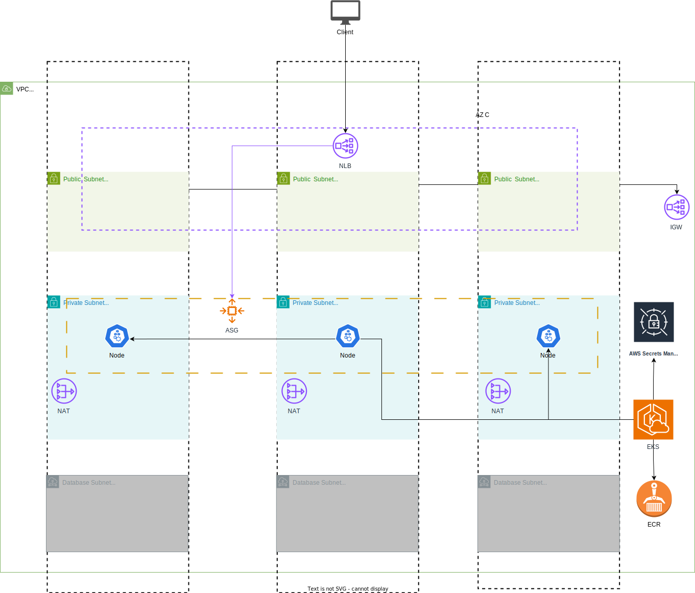

# Project Name: Flask AWS EKS Project

## Overview

This project is a Python application built using Flask. It provides functionality through three endpoints, each serving a specific purpose.

## Endpoints

* /ping   - return PONG in HTML format, status code 200 OK
* /       - return current weather in London, UK in HTML format, status code 200 OK
* /health - return HEALTHY, in JSON format, status code 200 OK

## Deployment

### AWS EKS

The application is deployed on AWS EKS (Elastic Kubernetes Service). This ensures scalability and efficient management of containerized applications.

### AWS Secret Manager

AWS Secret Manager is employed to securely store and manage the API key used by the application. This ensures a robust and secure method for handling sensitive information.

## Infrastructure as Code (IaC)

### Terraform Modules

#### 1. K8s Module

The K8s (Kubernetes) module in Terraform is designed to [explain the purpose and structure]. It defines the Kubernetes resources required for the application.

#### 2. Core Module

The Core module in Terraform encompasses [describe the role and components]. It includes infrastructure elements needed for the proper functioning of the application.

## Architecture Diagram

Below is the architecture diagram illustrating the key components and their interactions:

## Continuous Integration/Continuous Deployment (CI/CD)

### GitHub Actions

#### 1. app deploy:

* Description: This workflow automates the deployment of the application.
* Trigger: It runs whenever changes are pushed to the main branch.

#### 2. tf deploy:

* Description: Manages the Terraform deployment, ensuring infrastructure changes are reflected.
* Trigger: Executed when there are changes in the Terraform configurations.
